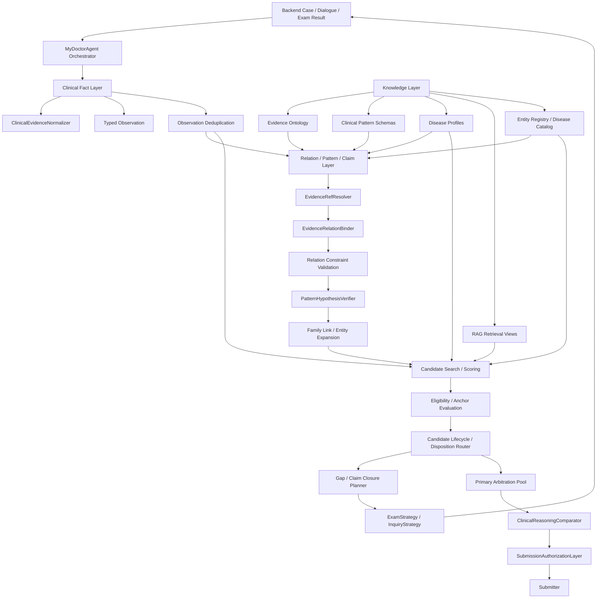
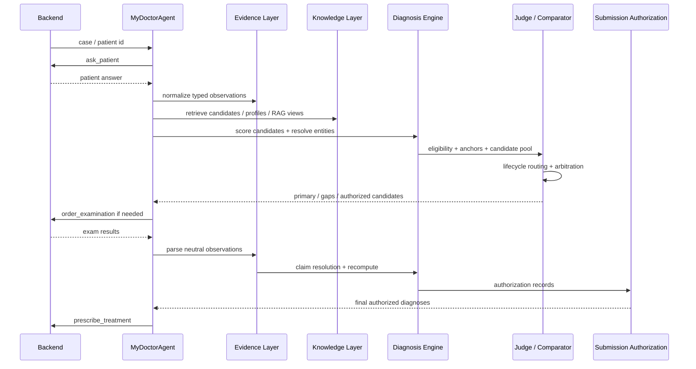

# Hospital Agent

这是一个面向虚拟诊疗评测后端的医生 Agent 项目。它不是单纯让 LLM 直接输出诊断，而是把病例处理拆成可审计的状态机：

```text
Raw Case / Patient Dialogue / Exam Result
        ↓
Typed Clinical Facts
        ↓
Evidence / Relation / Claim State
        ↓
Candidate Search + Eligibility
        ↓
Candidate Lifecycle / Arbitration
        ↓
Submission Authorization
        ↓
Dumb Submitter
```

核心目标是：**最终提交的诊断必须来自当前证据、当前裁决、当前授权**。候选召回、Pattern、RAG、LLM reasoning 都可以帮助系统发现方向，但不能直接创造 Evidence、Claim Resolution、Judge Score 或最终提交权限。

## Current Architecture



## Layer Boundaries

| Layer | Can Do | Must Not Do |
| --- | --- | --- |
| Evidence / Observation | Record source-grounded facts: symptom, sign, imaging finding, lab finding, treatment history, exposure, disease history | Infer disease, mechanism, or candidate eligibility |
| Relation / Pattern | Bind existing observations into controlled relation schemas; produce recall/family signals | Write observed evidence, change Judge score, create active gaps directly |
| Claim Resolution | Decide whether evidence supports, contradicts, or does not address a target claim | Diagnose disease or authorize final submission |
| Candidate Search / RAG | Retrieve candidates, profiles, external views, and context | Create Evidence or ClaimResolution from retrieved text |
| Eligibility / Anchor | Decide whether a candidate has minimum medical readiness | Decide encounter primary or final submission |
| Lifecycle / Disposition | Route every admitted candidate to workup, arbitration, primary, secondary, rejected, or differential-only | Recompute score, create evidence, or submit |
| Arbitration | Compare current primary against eligible challengers | Bypass evidence/anchor state or directly submit |
| Submission Authorization | Decide which established diagnoses are reportable in final answer | Re-rank candidates or invent secondary diagnoses |
| Submitter | Submit authorized diagnoses and treatment | Judge, filter, add, or suppress diagnoses by itself |

## Knowledge Sources

The project uses several knowledge sources with different permissions.

### Evidence Ontology

File: `data/ref_data/evidence_ontology.json`

Used by:

- evidence canonicalization
- alias and parent-child concept matching
- relation slot hints
- anatomical compatibility hints

It must not infer a diagnosis. For example:

```text
pulmonary_consolidation
        ↓
objective imaging fact
```

does not automatically mean:

```text
pneumonia
```

### Clinical Pattern Schemas

Files and modules:

- `agent/pattern_hypothesis.py`
- `agent/clinical_pattern_compiler.py`
- `agent/evidence_pattern_compiler.py`
- `agent/diagnostic_patterns.py`

Patterns define controlled multi-evidence structures such as exposure plus organ injury plus temporal/anatomical consistency. Pattern output is recall/verification oriented.

Pattern permissions stay strict:

```text
Pattern ≠ Evidence
Pattern ≠ Eligibility by itself
Pattern ≠ Judge Score
Pattern Gap Suggestion ≠ Active Gap
```

### Disease Profiles

Files:

- `data/ref_data/disease_profiles.json`
- `data/ref_data/disease_profiles_extra.json`

Disease profiles define disease metadata, expected evidence, required anchors, examination hints, and candidate scoring context. They are used by candidate search, eligibility, gap planning, and increasingly by claim/anchor contracts.

Current architectural status:

```text
Disease Profile
        ↓
Candidate Search / Eligibility / Gap / Exam Strategy

Evidence Ontology + Clinical Patterns
        ↓
Relation / Pattern Layer
```

The intended direction is a more unified Knowledge Layer where Disease Profile also becomes a stable source for Relation/Claim contracts. RAG and Disease Profiles still must not create observed evidence.

### RAG / Retrieval Views

Modules:

- `agent/rag_retriever.py`
- `agent/medical_retrieval.py`
- `agent/disease_retrieval.py`

RAG retrieves disease profiles, standard exams, case experience, external medical seed views, and policy notes. It is a context and candidate source, not a fact source.

Allowed:

- candidate/entity metadata
- differential context
- anchor or gap hints when represented structurally
- stage-specific LLM context

Forbidden:

- observed evidence
- claim resolution
- direct judge score bonus
- submission authorization

### Entity Registry / Disease Catalog

Files:

- `data/ref_data/diseases_catalog.json`
- `agent/disease_entity.py`
- `agent/diagnosis_resolver.py`

Controls disease IDs, aliases, canonical names, namespace legality, family/entity mapping, and submit names.

## Clinical Fact Layer

Module: `agent/clinical_evidence.py`

The evidence layer records what is observed or reported, with type and provenance.

Supported observation types include:

```text
symptom
sign
imaging_finding
laboratory_finding
treatment_history
medication_history
procedure_history
exposure
disease_history
```

Important rule:

```text
Observation = what was seen / reported / measured
Mechanism = possible why
Diagnosis = disease identity
```

For lung imaging, new objective morphology is de-etiologized:

```text
磨玻璃影       -> ground_glass_opacity
实变           -> pulmonary_consolidation
片状阴影       -> patchy_pulmonary_opacity
放疗野内病灶   -> lesion_within_prior_radiation_field
```

The parser should not emit `pneumonia_infiltrate` as a new objective imaging finding.

## Relation / Pattern Layer

Module: `agent/pattern_hypothesis.py`

Main components:

- `EvidenceRefResolver`
- `EvidenceRelationBinder`
- `RelationConstraintResult`
- `PatternHypothesisVerifier`
- `PatternRecallSignal`

Binding order is controlled and auditable:

```text
derived observation ref exact
canonical finding exact
controlled alias
ontology parent -> existing child observation
source provenance anchor
unresolved
```

Forbidden:

```text
fuzzy string matching
embedding similarity auto-binding
LLM free guessing
source_text re-extraction into new evidence
```

Relation activation depends on slots and constraints, not just high score. Example:

```text
thoracic_radiotherapy
        + dyspnea / cough
        + ground_glass_opacity / consolidation
        + temporal_after
        + anatomical_consistency
        ↓
exposure_temporal_organ_injury relation
```

## Claim Resolution And Gap Closure

Modules:

- `agent/claim_resolution.py`
- `agent/targeted_exam_result_parser.py`
- `agent/agent.py`

Claim closure is a state machine:

```text
Targeted Exam Result
        ↓
Neutral Observations / Explicit Relations
        ↓
ExamResultApplicability
        ↓
TargetClaimMatcher
        ↓
ClaimMatchEvent
        ↓
ClaimResolutionReducer
        ↓
ClaimResolutionLedger
        ↓
GapClosureEvaluator
        ↓
AnchorEvaluator / Eligibility
```

A claim can be:

```text
SUPPORTED
CONTRADICTED
NOT_ADDRESSED
INCONCLUSIVE
```

`NOT_ADDRESSED` does not downgrade an existing supported claim. It only records that this route did not answer that claim.

`ClaimResolutionLedger` is the source of truth. Gaps are hydrated from the ledger, not the other way around.

## Gap-Aware Exam Result Parsing

Module: `agent/targeted_exam_result_parser.py`

The parser is modality-aware and disease-agnostic:

```text
raw exam result
        ↓
atomic observations
        ↓
explicit relation observations
        ↓
claim matching
```

It must not output:

```text
radiation_pneumonitis = true
candidate D100058 supported
diagnosis = true
```

Instead, it emits source-grounded findings such as:

```text
ground_glass_opacity
pulmonary_consolidation
pulmonary_volume_loss
lesion_within_prior_radiation_field
```

Exam route authorization is gap-aware:

```text
Exam + Target Claim + Closure Route + Evidence Version + Prior Result State
        ↓
ExamRouteAuthorization
```

Completed claim routes are blocked unless there is an explicit repeat reason such as new target claim, prior inadequate result, tool failure, material clinical change, longitudinal monitoring, stale evidence, or contradiction resolution.

## Candidate Search And Scoring

Modules:

- `agent/candidate_generator.py`
- `agent/diagnosis_engine.py`
- `agent/disease_retrieval.py`
- `agent/rag_retriever.py`
- `agent/mechanism_reasoner.py`

Candidate sources include:

- disease profile retrieval
- evidence profile scoring
- RAG context
- open-world LLM candidate names mapped through resolver
- mechanism/family expansion
- pattern recall signals

Candidate search answers:

```text
Which diseases should be considered?
```

It does not answer:

```text
Which diagnosis is final?
```

## Eligibility And Anchor Evaluation

Modules:

- `agent/diagnosis_eligibility.py`
- `agent/diagnostic_patterns.py`
- `agent/claim_resolution.py`

Typical candidate states:

```text
PrimaryEligible
Deferred
DifferentialOnly
Excluded
```

Anchor state is separate:

```text
AnchorSatisfied
PatternSupportedButUnconfirmed
NoValidAnchor
HardBlocked
```

Important boundary:

```text
AnchorSatisfied ≠ PrimaryProtectedForever
PrimaryEligible ≠ Final Submission
```

## Candidate Lifecycle / Disposition

Module: `agent/diagnosis_judge.py`

The lifecycle layer is a derived projection, not a new mutable source of truth.

It reads:

- rank / score
- eligibility status
- anchor status
- active gaps / pending workup
- differential pool membership
- arbitration pool membership
- arbitration result
- rejection state
- submission role

It emits a current disposition for each admitted candidate:

```text
WORKUP_REQUIRED
READY_FOR_ARBITRATION
PRIMARY
SECONDARY
REJECTED
DIFFERENTIAL_ONLY
```

System invariant:

```text
For each candidate at each diagnostic_state_version,
there must be exactly one current lifecycle disposition
or one explicit terminal disposition.
```

Deadlock examples:

```text
PRIMARY_ELIGIBLE_NOT_IN_ARBITRATION_POOL
ARBITRATION_MEMBER_NOT_RESOLVED
DEFERRED_WITHOUT_ACTIONABLE_WORKUP
GAPLESS_DEFERRED_CANDIDATE
```

This prevents states like:

```text
PrimaryEligible
+ no gap
+ not compared
+ not rejected
+ not submitted
```

## Primary Arbitration

Modules:

- `agent/diagnosis_judge.py`
- `agent/clinical_reasoning_comparator.py`
- `agent/root_cause_arbitration.py`

Differential pool and arbitration pool are separate.

Differential pool controls search space:

```text
top-k
score proximity
tail specificity
pattern recall
active workup
```

Arbitration pool controls primary challenge rights:

```text
current primary
+ PrimaryEligible challengers
+ AnchorSatisfied challengers
+ protected mandatory contenders
+ incumbent challenge overrides
```

Comparator output includes:

```text
SWITCH_PRIMARY
KEEP_CURRENT_PRIMARY
UNLOCK_AND_DEFER
KEEP_CURRENT_AND_DEFER_CONTENDER
REJECT_CONTENDER
NO_MATERIAL_DIFFERENCE
```

Candidate Score is used only after clinical explanatory differences are not decisive.

## Submission Authorization

Module: `agent/submission_authorization.py`

Final submission is separated from diagnosis existence and primary arbitration.

Roles:

```text
PRIMARY
SECONDARY_INDEPENDENT
COMPLICATION
ASSOCIATED_FINDING
DIFFERENTIAL_ONLY
UNCONFIRMED
```

Authorization:

```text
AUTHORIZED
NOT_AUTHORIZED
DEFERRED
```

The submitter should be dumb:

```python
final_diagnoses = [
    record.diagnosis_name
    for record in authorization_records
    if record.submission_authorization == "AUTHORIZED"
]
```

Associated findings can remain in candidates/audit without entering final diagnosis.

## LLM Reliability Layer

Modules:

- `agent/llm.py`
- `agent/llm_contract.py`
- `agent/context_compiler.py`

The project separates:

```text
Runtime State ≠ LLM Context
```

Stage-specific context views:

```text
PlanningContextView
ThinkingContextView
DiagnosisContextView
RepairContextView
```

The context compiler performs semantic packing instead of blind truncation. Repair context is intentionally small:

```text
invalid output
+ validation errors
+ canonical schema
+ repair instructions
```

Contract execution flow:

```text
Generate
        ↓
Parse
        ↓
Deterministic Normalize
        ↓
Validate
        ↓
One bounded repair if needed
        ↓
Consumer Adapter
        ↓
Fallback if still invalid
```

`LLMCallAudit` records purpose, stage, model, latency, token counts, finish reason, parse/schema/consumer status, fallback trigger, and failure reason.

## Tool And Runtime Audit

Modules:

- `hospital_agent/base.py`
- `agent/agent.py`
- `agent/trace/*`

Every case can include:

```text
llm_call_audit
tool_call_audit
context_audit
clinical_runtime_audit
```

Tool audit tracks logical calls and HTTP attempts separately:

```text
logical_call_id
attempt_index
action
endpoint
http_status
latency_ms
success
failure_flags
primary_failure_reason
retry_exhausted
```

Clinical runtime audit preserves state snapshots even on failure:

```text
evidence_version
targeted_exam_result_parses
exam_result_applicability
claim_match_events
claim_resolution_ledger
claim_state_version
diagnostic_state_version
gap_state
anchor_state
eligibility_state
clinical_transition_trace
last_successful_clinical_transition
failure_stage
```

This allows debugging by first wrong transition rather than by guessing from final diagnosis.

## Main Runtime Flow



## Repository Map

```text
agent/
  agent.py                         Orchestrator, runtime state, train/test flow
  server.py                        HTTP service entrypoint
  clinical_evidence.py             Typed observation normalization
  evidence_engine.py               Evidence scoring support
  evidence_registry.py             Evidence metadata registry
  pattern_hypothesis.py            Relation binding, Pattern verification, recall signals
  clinical_pattern_compiler.py     Deterministic clinical pattern compiler
  evidence_pattern_compiler.py     Evidence pattern compiler
  claim_resolution.py              Claim events, ledger, gap hydration, anchor eval
  targeted_exam_result_parser.py   Gap-aware exam result parser
  candidate_generator.py           Candidate generation
  diagnosis_engine.py              Candidate scoring, entity resolution, decision engine
  diagnosis_eligibility.py         Eligibility and anchor state
  diagnosis_judge.py               Primary arbitration and candidate lifecycle
  clinical_reasoning_comparator.py Pairwise clinical explanatory comparison
  submission_authorization.py      Final diagnosis authorization
  exam_strategy.py                 Exam planning
  inquiry_strategy.py              Inquiry planning
  treatment_strategy.py            Treatment plan generation
  treatment_safety.py              Treatment safety filtering
  llm.py                           OpenAI-compatible LLM client
  llm_contract.py                  Stage contracts and repair
  context_compiler.py              Stage context semantic packing
  rag_retriever.py                 Hybrid RAG retrieval
  knowledge.py                     Catalog/profile loading
  memory.py / memory_system.py     Runtime memory and case experience
  trace/                           Append-only trace infrastructure

data/ref_data/
  diseases_catalog.json
  examinations_catalog.json
  disease_profiles.json
  disease_profiles_extra.json
  evidence_ontology.json
  medical_knowledge/

tools/
  run_diagnostic_replay.py
  run_diagnosis_judge.py
  run_frozen_training.py
  compare_pattern_recall_ab.py
```

## Configuration

Environment variables:

| Variable | Description |
| --- | --- |
| `SERVICE_BASE_URL` | Backend service URL |
| `SERVICE_TRAIN_TOKEN` | Training token |
| `MODEL_API_KEY` | Model API key |
| `TEAM_ID` | Team id |
| `MODEL_BASE_URL` | Optional OpenAI-compatible model base URL override |
| `MODEL_NAME` | Optional model name override |

Important `config.yaml` sections:

| Section | Purpose |
| --- | --- |
| `train` / `test` | patient selection, explicit patient ids, seeds |
| `service` | backend endpoint paths |
| `llm` | model, temperature, max tokens, retry, timeout |
| `diagnosis` | candidate scoring, pool sizes, pattern hypothesis policy |
| `execution` | case timeout, LLM budget, planner limits |
| `rag` | retrieval top-k, MQE, chunk filtering |
| `learning` | freeze active knowledge and promotion controls |
| `trace` | append-only runtime trace settings |

## Quick Start

Install dependencies:

```bash
pip install -r requirements.txt
```

Set environment variables:

```bash
export SERVICE_BASE_URL=https://baconroot-hospital-service.ms.show
export SERVICE_TRAIN_TOKEN=<token>
export MODEL_API_KEY=<model-key>
export TEAM_ID=<team-id>
```

Run training:

```bash
python train.py
```

Run service:

```bash
python -m agent
```

The service listens on port `7860` and exposes `POST /test`.

## Local Validation

Compile:

```bash
python -m compileall -q agent hospital_agent tools tests
```

Run tests:

```bash
python -m unittest discover -s tests -p "test_*.py" -v
```

Run strict replay:

```bash
python tools/run_diagnostic_replay.py tests/fixtures/diagnostic_replay_cases.jsonl --strict
```

Run frozen backend batches:

```bash
python tools/run_frozen_training.py --seeds 46 47 48 --patient-count 5
```

## Debugging Guide

When a case fails, inspect artifacts in:

```text
outputs/train/<run_id>/training_results.jsonl
outputs/train/<run_id>/training_summary.json
```

Start with these questions:

```text
1. Tool failed?
   -> tool_call_audit / tool_contract_summary

2. LLM failed?
   -> llm_call_audit / llm_contract_summary

3. Evidence missing?
   -> case_board_evidence / finding_extraction_summary

4. Exam result parsed?
   -> targeted_exam_result_parses / targeted_exam_observations

5. Claim state updated?
   -> exam_result_applicability / claim_match_events / claim_resolution_ledger

6. Candidate eligible but stuck?
   -> candidate_disposition_audit / candidate_lifecycle_transitions

7. Candidate compared but lost?
   -> clinical_reasoning_comparisons / primary_arbitration_decision

8. Diagnosis established but not submitted?
   -> submission_authorization_records / authorized_diagnoses
```

Preferred failure attribution style:

```text
candidate_recall
evidence_mapping
claim_contract_binding
claim_resolution_writeback
eligibility
candidate_lifecycle
arbitration
submission
tool_backend
llm_contract
```

## Development Rules

- Do not store tokens or raw LLM prompts in artifacts.
- Do not commit `outputs/`, runtime memory, pending state, or trace artifacts unless explicitly requested.
- Do not change official disease or exam catalogs casually.
- New observations must be source-grounded.
- New pattern or relation rules must preserve recall-only boundaries unless a separate eligibility contract explicitly consumes them.
- Final diagnoses must pass current-version Submission Authorization.

## Current Known Boundary

The current architecture already routes `PrimaryEligible` candidates into arbitration independently of ordinary differential ranking. However, claim applicability still depends on active claim contracts being available and hydrated at result-recovery time. If a candidate is recalled and eligible but its claim ledger is empty, inspect:

```text
exam_result_applicability
claim_match_events
claim_resolution_ledger
claim_state_version
candidate_disposition_audit
clinical_reasoning_comparisons
```

That distinction matters:

```text
Candidate admitted / compared
        ≠
Claim-verified candidate
        ≠
Submission-authorized diagnosis
```
